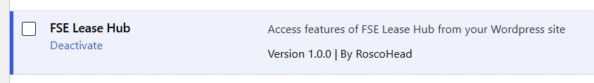
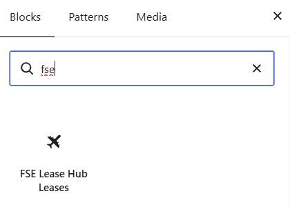
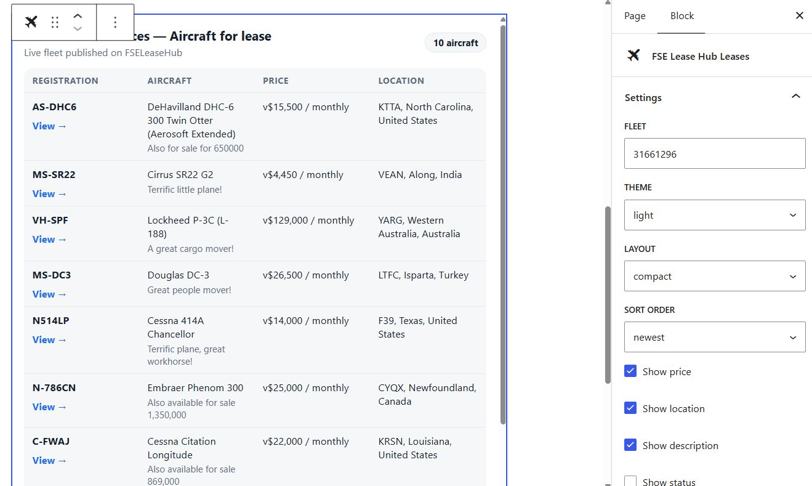

# FSE Lease Hub plugin

## Welcome!

This Wordpress plugin is designed to work with [FSE Lease Hub](https://fseleasehub.com), a site dedicated to leasing virtual aircraft in [FSEconomy](https://server.fseconomy.net).

## Getting started

To install the plugin simply download the .ZIP file, then follow [these instructions](https://wordpress.com/support/plugins/install-a-plugin/#install-a-plugin-with-a-zip-file).

Once the FSE Lease Hub plugin is installed, activate it on the plugins page to access all it's features.



## Blocks

### Leases block

The leases block allows you to easily include a list of your currently available aircraft leases on any post or page. When editing a post, simply display the block selection bar, and search "FSE", or scroll down to the "Embads" category to find the "FSE Lease Hub Leases" block.



After adding it to your post, first you must enter your FSE Lease Hub fleet code, which can be found on the FSE Lease Hub tools page. Then you can choose the other block options as desired. The preview will display your settings as you select them, allowing you to easily customise it to your needs.



## Global defaults

Go to `Ajustes > FSE Lease Hub` and set your Fleet (board ID from the tools page), theme, layout, order, limit, height and fields to show. The block and the shortcode use these when they omit attributes.

## Shortcode (for Classic themes, Elementor/Divi, widgets)

No attributes = uses global defaults:

```
[fse_lease_hub]
```

Override only what you need (aliases: `board=fleet`, `sort=order`):

```
[fse_lease_hub fleet="123" layout="list" theme="dark" limit="10" height="600" show="price,location,status"]
[fse_lease_hub_leases fleet="123"]
```

Per-field alternative to `show="..."`: `show_price="0" show_location="1" ...`. Works in Classic editor, Gutenberg Shortcode block, Text widgets and Elementor/Divi shortcode widgets. Same `<iframe>` output as the block.
