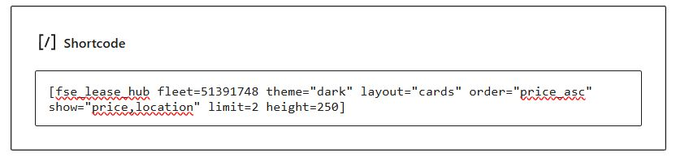
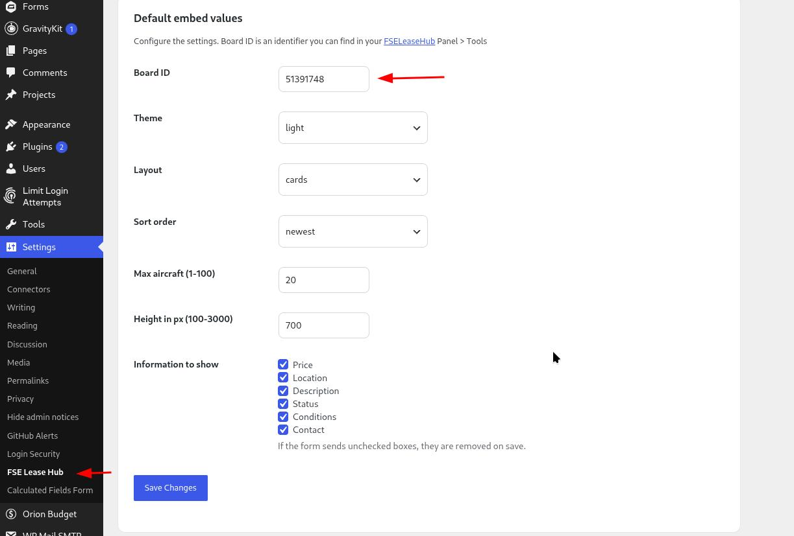

# FSE Lease Hub plugin

## Welcome!

This Wordpress plugin is designed to work with [FSE Lease Hub](https://fseleasehub.com), a site dedicated to leasing virtual aircraft in [FSEconomy](https://server.fseconomy.net).

## Getting started

To install the plugin simply download the .ZIP file, then follow [these instructions](https://wordpress.com/support/plugins/install-a-plugin/#install-a-plugin-with-a-zip-file).

Always use the latest [Release](https://github.com/RoscoHead/FSE_Lease_Hub/releases) of this project to stay update.

Once the FSE Lease Hub plugin is installed, activate it on the plugins page to access all it's features.

 
## Blocks

### Leases block

The leases block allows you to easily include a list of your currently available aircraft leases on any post or page. When editing a post, simply display the block selection bar, and search "FSE", or scroll down to the "Embads" category to find the "FSE Lease Hub Leases" block.

To add your lists, the block will ask you for a Board ID.

You can find this Board ID in your FSELeaseHub account under Tools, in the WordPress section. The preview will display your settings as you select them, allowing you to easily customise it to your needs.

## ShortCodes

### Leases ShortCode

Shortcodes were created for WordPress themes that do not use the block system. This way, you can add this shortcode to your text block and display this information in Divi or other themes that use custom page builders or block systems.

It will use the values stored in the Settings / FSE Lease Hub page (see below) unless over-ridden by ShortCode attributes. All attributes are optional; if omitted or not in the correct format the default Settings value will be used.

## Settings

You can find its configuration and usage in your WordPress menu: Settings

The page will ask you for a Board ID.

You can find this Board ID in your FSELeaseHub account under Tools, in the WordPress section.
